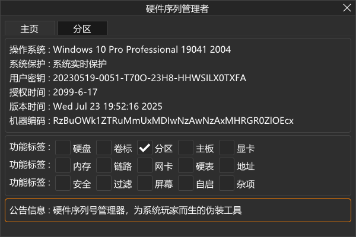

# 程序界面

# 硬件序列管理者

在现代操作系统中，硬件序列号已成为重要的设备身份标识，被广泛应用与授权校验、数据绑定、用户追踪等各类场景。然而对于开发者、技术用户或资深玩家而言，能否自主控制这些底层信息，直接影响到系统的灵活性与隐私安全。
因此，硬件序列号管理大师应运而生！面向对系统有深度需求的用户群体，提供安全、无痕、全面的序列号信息调整能力。

## 软件支持你修改：
- 硬盘序列号（包括主盘、扩展盘、卷标、分区...）
- 主板标识符（包括UUID、序列号...）
- 网卡MAC地址（多网卡支持、IPv4、IPv6...）
- 显示器和内存条的厂商以及序列号信息
- 地址、硬件GUID等附属参数

## 软件特别适合以下用户使用：
- 多系统环境切换、克隆部署、测试沙箱场景
- 软件测试与反检测环境创建
- 注意隐私保护的用户人群
- 系统完全控制自己系统的技术极客

**在不动硬件、不改系统结构的前提下，完成完整的数字伪装。所有修改将在系统重启后自动恢复原始值，避免永久更改导致意外问题。**

操作直观、无需脚本、所见即所得。不需要写一行代码，就能够完成操作系统层级的身份重建。
**这不是一个玩具，它是一种掌控感的延伸！**

## 更新日志：
- [2025.06.14] 第一个版本，基本功能已经完善。
- [2025.06.23] 第二次更新，加入禁用内存SPD序列号功能。
- [2025.06.27] 第三次更新，加入自启动（未完成）、屏幕（未完成）、修复某些系统无法成功加载驱动问题。
- [2025.06.29] 第四次更新，自启动支持硬盘、卷标、主板、网卡这四个功能了。
- [2025.06.30] 第五次更新，优化一些自启动功能。
- [2025.07.02] 第六次更新，优化主板信息按照类型显示与修改。
- [2025.07.03] 第七次更新，支持查看NVIDIA显卡信息，至于如何修改还在研究中。
- [2025.07.10] 第八次更新，支持修改NVIDIA显卡的UUID，兼容性有待测试，当前NVIDIA版本576.88测试正常。
- [2025.07.23] 第九次更新，注册表过滤一些问题修复，支持从文件中导入配置。
- [2025.07.27] 第十次更新，优化了部分驱动算法。

## 登录密钥：
**20230519-0051-T70O-23H8-HHWSILX0TXFA**

## 系统要求：
Windows10 - Windows11全系列64位操作系统。

## 程序协议：
如果需要正常使用程序，需要同意首次运行弹出的用户协议与免责声明。
请遵守当前用户所属国家和地区的相关法律法规，严禁用于任何违法用途，严禁用于侵害第三方软件(程序)利益的各种违法行为。

## 视频教程：
- [程序使用教程](https://easylink.cc/ecc6rn)
- [修改C盘分区教程](https://easylink.cc/7njvyr)
- [禁用SPD内存教程](https://easylink.cc/1mjywm)
- [设置自启动教程](https://easylink.cc/mitb6r)
- [修改NVIDIA显卡UUID教程](https://easylink.cc/aqhggh)

## 下载地址
[蓝奏云 2025-07-27](https://wwqp.lanzouw.com/ighuZ31xoy1c)

## 问题反馈
[telegram](https://t.me/indigosable)
